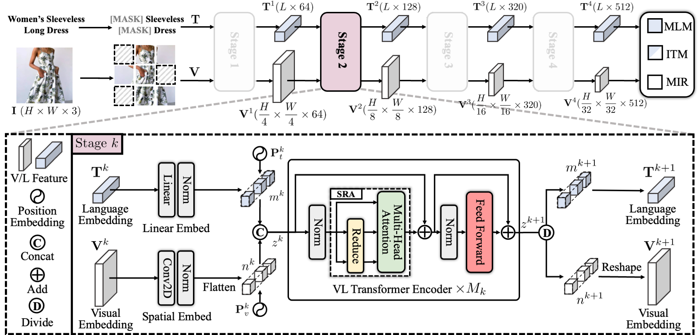

# Masked Vision-Language Transformer in Fashion

- Authors: Ge-Peng Ji^, Mingcheng Zhuge^, Dehong Gao, Deng-Ping Fan#, Christos Sakaridis, and Luc Van Gool
- Accepted by  Machine Intelligence Research 2023
- Link: [arXiv Paper](https://arxiv.org/abs/2210.15110) 
- This project is still working in progress, and we invite all to contribute in making it more accessible and useful. If you have any questions, please feel free to drop us an e-mail (gepengai.ji@gmail.com) or directly report it in the issue or push a PR. 
- Your star is our motivation, let's enjoy it!
- Welcome to our WeChat Group ([QR Code](https://github.com/GewelsJI/MVLT/blob/main/assets/wechat_qr_code.JPG))

# Dataset Preparation

This project conducts several experiments on the public dataset, Fashion-Gen, which contains 260,480 training text-image pairs for training and 35,528 text-image pairs for inference. The MVLT model can directly process the original image and text without any feature engineering pre-processing of the data. However, it is necessary to sort out the storage form of the data to facilitate the dataloader of torch:

Please download the reorganized dataset from [Google Drive (9.72GB)](https://drive.google.com/file/d/1xMJi0BSRO_f-upWT5Z856Ho3B3sCAilr/view?usp=sharing).

# Prelimilaries

Installing the basic libraries python3.6, pytorch1.8, cuda10.1 on UBUNTU18.04. I did validate the flexibility on other versions of libraries and systems, but I think it is easy to adapt with minor changes. 
- Create env via `conda create -n MVLT python=3.6`
- Installing Pytorch via `~/miniconda3/envs/MVLT/bin/python3.6 -m pip install torch==1.8.0+cu111 torchvision==0.9.0+cu111 torchaudio==0.8.0 -f https://download.pytorch.org/whl/torch_stable.html`
- Installing the auxiliary libraries via running `~/miniconda3/envs/MVLT/bin/python3.6 -m pip install -r requirements.txt`
- The checkpoint of PVT-tiny for pre-training is prepared at `./preweights/pvt_v1/pvt_tiny.pth`. You can also try other PVT-v1 and PVT-v2 variants ([download link](https://github.com/whai362/PVT/tree/v2/classification#model-zoo)) to further boost the performance if enough GPU memory is available for you.
- Downloading the checkpoint from [Google Drive (689.4MB)](https://drive.google.com/file/d/1f1LPELbAEgPUKD8L3uJcof2XljJCWVnH/view?usp=sharing) and move them into `./checkpoints/`. Note this tar.gz file contains two weights: `checkpoint_retrieval.pth` and `checkpoint_recognition.pth`.

# Training

> Please note that we only use PVT-Tiny to learn multi-modal features, and other stronger backbone would further improve representation abilities, such as SwinTransformer or PVTv2.

- Please revise your data path (`--data-path` parameter) in `./scripts_dws/dws_mvlt_exp21.sh` or `./scripts_dws/dws_mvlt_ft_exp48.sh`
- Just run `bash ./scripts_dws/dws_mvlt_exp21.sh` for pre-training
- Just run `bash ./scripts_dws/dws_mvlt_ft_exp48.sh` for fine-tuning

# Inference

- Downstream retrieval tasks
  - We provide the zero-shot retrieval performance without any finetuning process, and thus, the well-trained weight could be directly used in the retrieval tasks.
  - Just run `bash downstream_retrieval.sh` and then get the prediction results of Image-Text Retrieval (ITR) and Text-Image Retrieval (TIR).
    - Text-Image Retrieval (TIR): acc@1: 0.346, acc@5: 0.780, acc@10: 0.895
    - Image-Text Retrieval (ITR): acc@1: 0.331, acc@5: 0.772, acc@10: 0.911

- Downstream recognition tasks
  - This task needs the fine-tuning process because our pre-trained model is not equipped with the classification head.
  - Just run `bash downstream_recognition.sh` and then get the prediction results of Main-Category Recognition (M-CR) and Sub-Category Recognition (S-CR).
    - Main-category recognition (M-CR): accuracy (0.9825996064928677) macro_f1 (0.8954719842489123) 
    - Sub-category recognition (S-CR): accuracy (0.9356554353172651) macro_f1 (0.8285927576055913) 

# Citation

    @article{ji2023masked,
      title={Masked Vision-Language Transformer in Fashion},
      author={Ji, Ge-Peng and Zhuge, Mingchen and Gao, Dehong and Fan, Deng-Ping and Sakaridis, Christos and Van Gool, Luc},
      journal={Machine Intelligence Research},
      year={2023}
    }

Here are two concurrent works from Alibaba ICBU Team.

    @inproceedings{zhuge2021kaleido,
      title={Kaleido-bert: Vision-language pre-training on fashion domain},
      author={Zhuge, Mingchen and Gao, Dehong and Fan, Deng-Ping and Jin, Linbo and Chen, Ben and Zhou, Haoming and Qiu, Minghui and Shao, Ling},
      booktitle={CVPR},
      pages={12647--12657},
      year={2021}
    }

    @inproceedings{10.1145/3397271.3401430,
      author = {Gao, Dehong and Jin, Linbo and Chen, Ben and Qiu, Minghui and Li, Peng and Wei, Yi and Hu, Yi and Wang, Hao},
      title = {FashionBERT: Text and Image Matching with Adaptive Loss for Cross-Modal Retrieval},
      year = {2020},
      publisher = {Association for Computing Machinery},
      booktitle = {Proceedings of the 43rd International ACM SIGIR Conference on Research and Development in Information Retrieval},
      pages = {2251–2260},
      numpages = {10},
      location = {Virtual Event, China},
      series = {SIGIR '20}
    }

# Acknowlegement
Thanks, Alibaba ICBU Search Team and Wenhai Wang ([PVT](https://github.com/whai362/PVT)) for their technical support.
